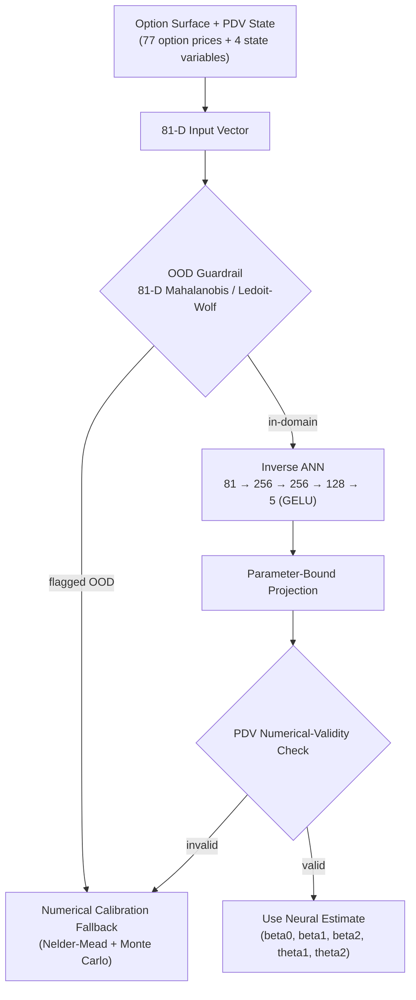
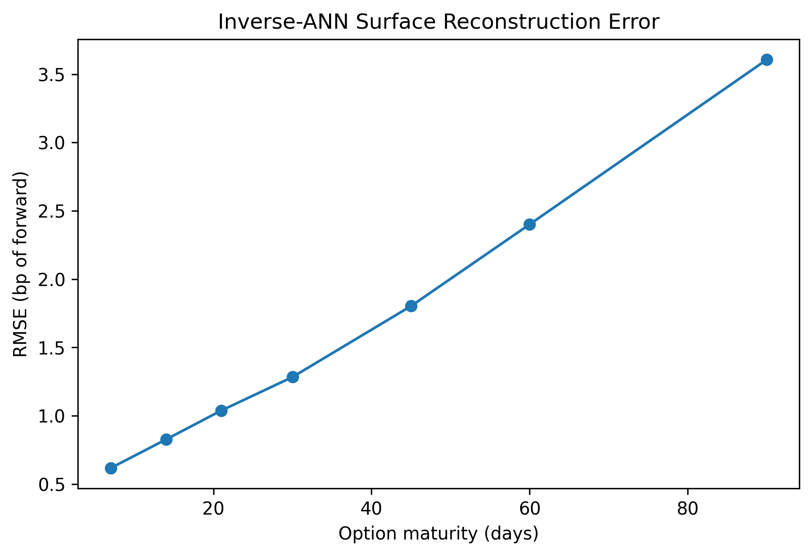
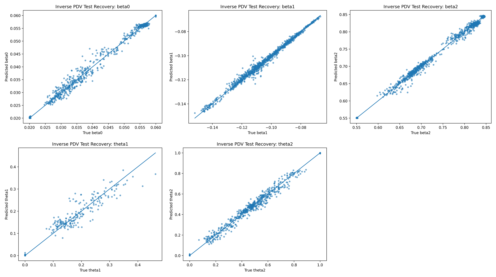
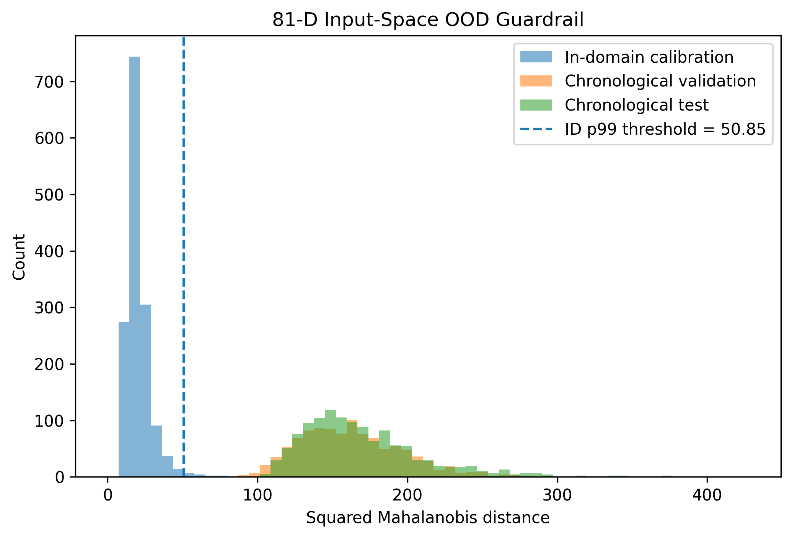

# Neural Surrogates for Path-Dependent Volatility

**Low-latency inverse calibration of a non-Markovian Path-Dependent Volatility model with statistical and numerical guardrails.**

A low-latency inverse neural surrogate for calibrating a non-Markovian Path-Dependent Volatility (PDV) model from option surfaces, with explicit statistical and numerical guardrails for unsupported market states.

University of Minnesota undergraduate research project (UROP), advised by Prof. John Dodson.

> **Attribution.** The core PDV pricing engine (`calibration/`, `empirical_study/`, and both root notebooks) is the original implementation accompanying Guyon & Lekeufack, *"Volatility is (Mostly) Path Dependent"*. Everything under `scripts/` and `docs/`, plus the inverse-ANN surrogate and guardrail architecture described below, is this UROP's original contribution. See [Attribution](#attribution) for the full breakdown.

---

## Why this project?

The Guyon–Lekeufack PDV model prices options by representing volatility as a function of weighted averages of *past* returns — the process is **non-Markovian**, so simulating or calibrating it requires full Monte Carlo path generation (here, via a 4-factor Markovian representation of the path-dependence, run on GPU/CPU with tens of thousands of paths). That makes exact calibration to a live option surface too slow for anything resembling real-time use: every new quote snapshot would otherwise demand a fresh Monte Carlo-based numerical optimization.

This project asks a narrower question: **can a neural network learn the inverse map — from an observed option surface plus the model's current path-dependent state, directly to the five calibrated PDV parameters — fast enough to act as an online "digital twin" of the expensive numerical calibration, while knowing when it shouldn't be trusted?**

That last clause matters as much as the speed. An inverse surrogate trained on a bounded neighborhood of historical market regimes will silently produce plausible-looking but meaningless output once the market moves outside that neighborhood. So the surrogate here is not deployed alone — it sits behind an out-of-distribution (OOD) detector and a numerical-validity check, with a fallback to the original numerical calibration whenever either one fires. The goal is a *system*, not just a model: a fast primary path with an honest circuit breaker.

## Architecture



**Important caveat:** the numerical-validity check itself may involve reference-model work, so the *full* guarded end-to-end pipeline latency has not been benchmarked — only the ANN forward pass has (see [Key Results](#key-results)).

## Key Results

All figures below come from the in-domain synthetic interpolation test set — see [Limitations](#what-failed--limitations) for why this is not the same claim as chronological market generalization.

| Metric | Value |
| --- | ---: |
| Valid synthetic scenarios | 9,667 / 10,000 |
| In-domain test scenarios | 959 |
| Parameter R² (beta0 / beta1 / beta2 / theta1 / theta2) | 0.9934 / 0.9883 / 0.9943 / 0.9689 / 0.9933 |
| Mean surface repricing RMSE (955/959 valid) | 1.41 bp of forward |
| Median surface repricing RMSE | 1.05 bp |
| 95th-percentile / max repricing RMSE | 3.86 bp / 9.31 bp |
| Fresh-seed repricing RMSE (192 paired comparisons, 3 unseen MC seeds) | 1.32 bp, mean |
| Median ANN forward-pass latency (CPU) | 0.109 ms |
| p99 ANN forward-pass latency (CPU) | ≈ 0.120 ms |
| Chronological OOD detection (later unseen dates) | 100% flagged |
| In-domain p99 flag rate (false-positive rate) | ≈ 1.01% |
| Chronological OOD AUROC (81-D Mahalanobis) | ≈ 0.999999 |

Latency figures refer **only** to the neural network's CPU forward pass, not to the guarded end-to-end pipeline. Full metric tables and methodology: [`docs/RESULTS.md`](docs/RESULTS.md).

<p align="center">
  
</p>

<p align="center"><em>Surface reconstruction RMSE by maturity using inverse-ANN-predicted PDV parameters. Error remains at the basis-point scale across the 7–90 day option grid.</em></p>

<p align="center">
  
</p>

<p align="center"><em>True-vs-predicted parameter recovery on the untouched 959-scenario test set. beta0, beta1, beta2, and theta2 track the diagonal closely (R² ≥ 0.988); theta1 is visibly noisier (R² = 0.9689), consistent with its lower rank in the table above.</em></p>

## Model

- **Input (81 features):** 77 normalized option prices across 7 maturities (≈7, 14, 21, 30, 45, 60, 90 days), 11 log-moneyness coordinates per maturity, plus 4 path-dependent PDV state variables (`R1_fast`, `R1_slow`, `R2_fast`, `R2_slow`).
- **Output (5 parameters):** `beta0`, `beta1`, `beta2`, `theta1`, `theta2` — the calibrated PDV parameters (a restricted five-parameter model; the parabolic skew term and its offset are fixed, not learned).
- **Architecture:** `81 → 256 → 256 → 128 → 5`, GELU activations, both inputs and targets standardized (mean/std fit on training data only).
- **Guardrail:** projection of raw ANN output onto documented parameter bounds, followed by a numerical-validity check on the resulting PDV path before the estimate is trusted.

## Research Workflow

```
Historical SPXW/SPX quotes (ThetaData, 20 dates, May 5 – Jun 2, 2021, ~3:55pm ET)
        -> fixed 77-coordinate option grid per date
        -> historical five-parameter PDV calibration (Nelder-Mead, 4,000 MC paths)
        -> independent numerical validation (20,000 paths, 3 additional seeds)
        -> 16 / 20 dates numerically stable -> robust empirical anchors
        -> bounded local synthetic perturbations (10,000 candidates, logit-space jitter around anchors)
        -> Monte Carlo surface generation per candidate -> 9,667 valid scenarios
        -> chronological + interpolation train/validation/test splits
        -> inverse ANN training (81 -> 256 -> 256 -> 128 -> 5)
        -> frozen 959-scenario test evaluation (parameter R²)
        -> full PDV repricing of held-out predictions
        -> fresh-seed robustness validation (3 unseen MC seeds, 192 paired comparisons)
        -> 81-D Mahalanobis / Ledoit-Wolf OOD analysis (chronological generalization test)
        -> leave-one-anchor-out state-guardrail diagnostic
        -> final figures
```

Methodology detail: [`docs/RESEARCH_OVERVIEW.md`](docs/RESEARCH_OVERVIEW.md).

## Guardrails

The surrogate is never trusted unconditionally. Four independent mechanisms gate its output:

1. **OOD detection** — squared Mahalanobis distance over the full 81-D input space (option surface + state), with Ledoit-Wolf covariance shrinkage to stabilize the estimate. A separate state-only (4-D) detector and a leave-one-anchor-out diagnostic probe how much of the OOD signal comes from the state variables alone.
2. **Parameter-bound projection** — raw ANN output is clipped to physically meaningful parameter bounds before use.
3. **PDV numerical-validity check** — the projected parameters are checked against the PDV model's own validity conditions (e.g., no nonpositive/nonfinite volatility) before the estimate is accepted.
4. **Fallback numerical calibration** — any OOD flag or validity failure routes to the original Nelder-Mead + Monte Carlo calibration instead of the neural estimate.

<p align="center">
  
</p>

<p align="center"><em>81-D Mahalanobis OOD separation. The p99 held-out in-domain threshold (~50.85) flags all tested later chronological states while rejecting ~1% of held-out in-domain observations.</em></p>

Full discussion, including the Ledoit-Wolf shrinkage rationale and chronological OOD findings: [`docs/GUARDRAILS.md`](docs/GUARDRAILS.md).

## What failed / limitations

Being explicit about failure modes here is deliberate — it's part of what the guardrail architecture above exists to handle.

- **Chronological (later-date) generalization was poor.** The ANN's strong metrics above describe in-domain synthetic *interpolation* around 16 historical anchors — not extrapolation to genuinely new, unseen market states. When evaluated chronologically, unseen later states were reliably distinguishable as out-of-distribution rather than well-predicted.
- **Only 16 of 20 historical calibrations were usable as anchors.** 4 of the 20 historical dates failed independent 20,000-path numerical validation (nonpositive volatility) and were excluded from the anchor set.
- **4 of 959 same-seed test predictions remained numerically invalid after bound projection** and required the fallback path rather than being priced directly.
- **This is a restricted, five-parameter model.** The parabolic skew term and its offset are held fixed; only `beta0`, `beta1`, `beta2`, `theta1`, `theta2` are calibrated/learned.
- **The full guarded end-to-end pipeline has not been latency-benchmarked.** Only the isolated ANN forward pass (0.109 ms median) has been measured; the numerical-validity check may itself involve reference-model work not included in that figure.
- **No live deployment, no trading claim.** This is a calibration-speed and validation study, not a trading strategy or production system.

## Repository Structure

```
.
├── calibration/                        # Upstream: 4-factor Markovian PDV Monte Carlo engine
│   ├── torch_montecarlo.py             #   (Guyon & Lekeufack reference implementation)
│   └── torch_utils.py
├── empirical_study/                    # Upstream: original historical-fitting utilities
├── empirical_study.ipynb               # Upstream: historical fitting walkthrough notebook
├── option_pricing_4fmpdv.ipynb         # Upstream: 4F-PDV option pricing walkthrough notebook
│
├── scripts/                            # UROP additions
│   ├── thetadata/                      #   ThetaData SPX/SPXW ingestion, IV-surface construction, fixed 77-coordinate grid
│   ├── pdv/, compare/                  #   Early PDV-vs-market smile diagnostics and parameter sweeps
│   ├── calibration/                    #   20-date historical 5-parameter Nelder-Mead calibration, independent
│   │                                   #     validation, robust-anchor selection, anchor-jitter synthetic dataset,
│   │                                   #     train/validation/test split construction
│   ├── surrogate/                      #   Inverse ANN training/evaluation, repricing, fresh-seed robustness,
│   │                                   #     Mahalanobis/Ledoit-Wolf OOD guardrail, leave-one-anchor-out diagnostic
│   └── analysis/                       #   Final figure generation
│
├── docs/                               # Research documentation (UROP additions)
│   ├── RESEARCH_OVERVIEW.md
│   ├── GUARDRAILS.md
│   ├── REPRODUCIBILITY.md
│   ├── RESULTS.md
│   └── *.md                            #   Earlier exploratory notes (ThetaData schema, first PDV-vs-market result)
│
├── run_pdv_notebook.slurm               # UROP: MSI SLURM launch scripts
├── run_python_baseline.slurm
├── requirements.txt
└── README.md
```

`scripts/*.slurm` files alongside their `.py` counterparts are the corresponding MSI SLURM job submissions.

## Quick Start / Reproducing the Research

This is an honest accounting of what is and isn't reproducible from this repository alone:

- **The upstream PDV Monte Carlo engine** (`calibration/`, `empirical_study/`, both notebooks) is fully self-contained and runnable with only `pip install -r requirements.txt` — see the original usage notes preserved in [`docs/REPRODUCIBILITY.md`](docs/REPRODUCIBILITY.md).
- **The ThetaData ingestion scripts** (`scripts/thetadata/`) require a licensed ThetaData subscription and a running ThetaData Terminal; raw/licensed market data is intentionally not distributed in this repository. See `requirements-thetadata.txt` for the additional client package.
- **The historical calibration, synthetic dataset generation, ANN training/evaluation, and guardrail analysis scripts** (`scripts/calibration/`, `scripts/surrogate/`, `scripts/analysis/`) are runnable once the ThetaData-derived option-surface CSVs exist, in the pipeline order shown in [Research Workflow](#research-workflow). Generated datasets, trained model checkpoints, and result CSV/JSON files are intentionally gitignored (`data/`, `benchmarks/`) and are not included here.
- **There is no single-command reproduction.** The pipeline was run incrementally across many MSI SLURM array jobs; see [`docs/REPRODUCIBILITY.md`](docs/REPRODUCIBILITY.md) for the full command sequence, seeds, and expected outputs at each stage.

## Selected Figures

The Mahalanobis OOD separation and repricing/parameter-recovery figures above are generated by `scripts/analysis/build_pdv_inverse_final_figures.py` and committed under `docs/assets/` — see [`docs/assets/README.md`](docs/assets/README.md) for provenance. Only these summary figures are committed to keep the repository lean; the full set of per-parameter recovery plots and the fresh-seed robustness chart are in the written report ([Research Report](#research-report)).

## Research Report

The full written UROP report is available at [`docs/report/pdv_surrogate_report.pdf`](docs/report/pdv_surrogate_report.pdf).

## References

- Guyon, J., & Lekeufack, J. (2023). *Volatility Is (Mostly) Path-Dependent.* [SSRN 4174589](https://papers.ssrn.com/sol3/papers.cfm?abstract_id=4174589).
- Horvath, B., Muguruza, A., & Tomas, M. (2021). *Deep Learning Volatility.* Quantitative Finance, 21(1), 11–27.
- Glasserman, P. (2003). *Monte Carlo Methods in Financial Engineering.* Springer.

## Acknowledgments

- Prof. John Dodson, University of Minnesota — faculty advisor.
- Minnesota Supercomputing Institute (MSI) — HPC/SLURM compute resources used for historical calibration, synthetic dataset generation, and inverse-ANN training.
- Jordan Lekeufack and Julien Guyon — original PDV model and reference Monte Carlo implementation (`calibration/`, `empirical_study/`, both root notebooks).

## Attribution

| Component | Origin |
| --- | --- |
| `calibration/torch_montecarlo.py`, `calibration/torch_utils.py` | Upstream (Guyon & Lekeufack) |
| `empirical_study/`, `empirical_study.ipynb`, `option_pricing_4fmpdv.ipynb` | Upstream (Guyon & Lekeufack) |
| `scripts/thetadata/` — ThetaData historical option-surface pipeline, fixed 77-coordinate grid | UROP |
| `scripts/calibration/` — historical five-parameter PDV calibration, independent numerical validation, robust anchor selection, synthetic anchor-jitter dataset generation, train/validation/test split logic | UROP |
| `scripts/surrogate/` — inverse ANN training, frozen test evaluation, full PDV repricing evaluation, fresh-seed robustness testing, latency benchmarking, Mahalanobis/Ledoit-Wolf OOD analysis, leave-one-anchor-out diagnostics | UROP |
| `scripts/analysis/` — final visualization/reporting scripts | UROP |
| `docs/` | UROP |

No LICENSE file currently exists in this repository, and none was present upstream. Any future licensing decision should account for the provenance of the upstream implementation — see the note in [`docs/REPRODUCIBILITY.md`](docs/REPRODUCIBILITY.md).
